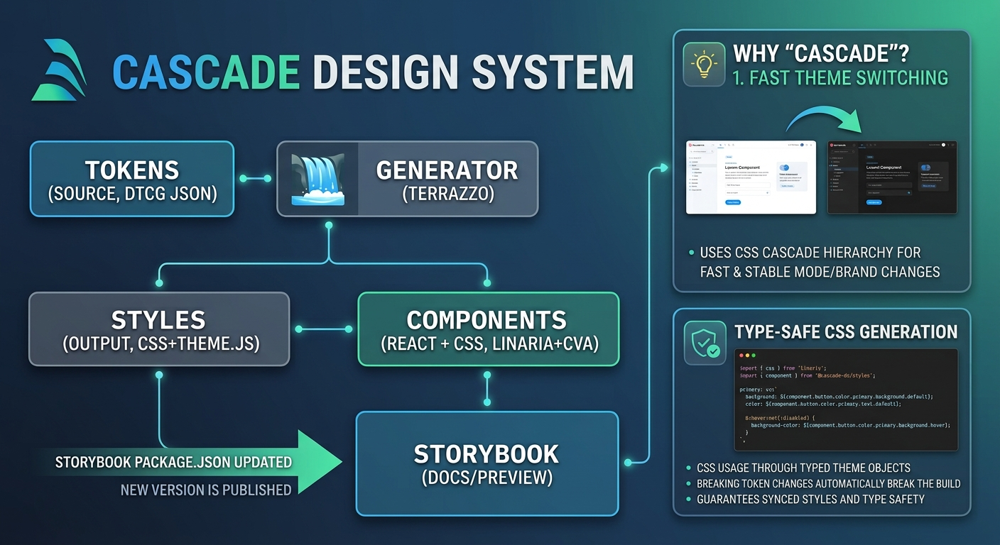
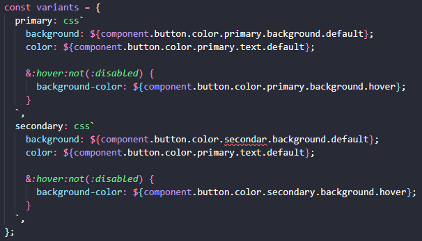
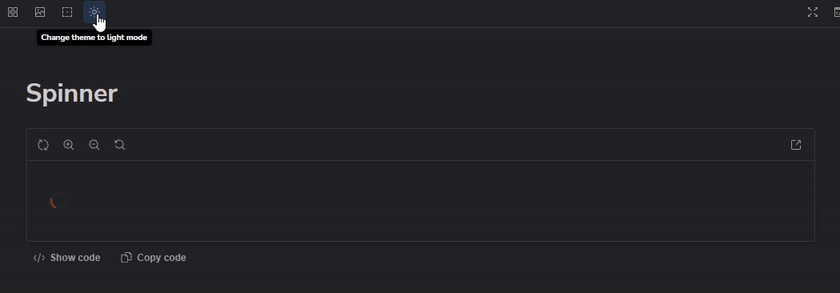
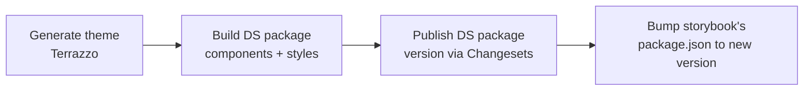

# Cascade DS

A token-driven React design system: design tokens in, themed CSS + typed
components out. Built as a pnpm workspaces monorepo with four packages that
form one pipeline:

```
tokens  →  generator  →  styles  →  components  →  storybook
(source)   (Terrazzo)    (output)   (React + CSS)   (docs/preview)
```

- **[`packages/tokens`](./packages/tokens)** — [DTCG](https://www.designtokens.org/)-format
  JSON token source of truth (primitive → semantic → component layers),
  composed via a resolver.
- **[`packages/generator`](./packages/generator)** — runs
  [Terrazzo](https://terrazzo.app/) against the token resolver to produce
  CSS custom properties and a typed theme object.
- **[`packages/styles`](./packages/styles)** — the generated output
  (`index.css`, `theme.js`, `theme.d.ts`). Nothing here is hand-written.
- **[`packages/components`](./packages/components)** — React components,
  styled with [Linaria](https://linaria.dev/) +
  [`class-variance-authority`](https://cva.style/), consuming
  `@cascade-ds/styles`.
- **[`packages/storybook`](./packages/storybook)** — Storybook instance for
  developing and reviewing components in isolation.

See the [ADRs](./adr) for the reasoning behind the generator, styling,
accessibility-testing, and monorepo-tooling choices; the
[package READMEs](./packages) go deeper on each stage.

Contributing a component? Start with
[HOW-TO-CONTRIBUTE.md](./HOW-TO-CONTRIBUTE.md) — it covers the required
file layout, styling/testing/story conventions, and the checks to run
before opening a PR. Architectural rules (e.g. which tokens a layer may
import) are enforced automatically as [fitness functions](./fitness) —
see [ADR-005](./adr/ADR-005-fitness-functions.md).

## Stack

| Concern            | Choice                                              |
| ------------------ | ---------------------------------------------------- |
| Language           | TypeScript (strict), React 19                        |
| Monorepo tooling   | pnpm workspaces + [Changesets](https://github.com/changesets/changesets) (versioning/publishing) |
| Token format       | DTCG JSON, composed via a DTCG resolver               |
| Token generator    | Terrazzo (`@terrazzo/cli`, `plugin-css`, `plugin-css-in-js`) — see [ADR-001](./adr/ADR-001-generator.md) |
| Component styling  | Linaria (zero-runtime CSS-in-JS) + `class-variance-authority` for variants — see [ADR-002](./adr/ADR-002-styling-library.md) |
| Component bundling | Rollup (`packages/components`) + `@wyw-in-js` for Linaria extraction |
| Testing            | Vitest + React Testing Library (jsdom) for component unit tests, Istanbul coverage |
| Accessibility testing | Storybook `addon-a11y` via `addon-vitest` (Playwright/Chromium) — see [ADR-003](./adr/ADR-003-a11y-testing.md) |
| Linting/formatting | ESLint (typescript-eslint, jsx-a11y, react-hooks) + Prettier |
| Docs/preview       | Storybook 10 (`@storybook/react-vite`)                |

### Why Terrazzo over Style Dictionary

Style Dictionary made light/dark (and future) theme permutations awkward to
model. Terrazzo's CSS plugin generates per-theme permutations directly, and
its `plugin-css-in-js` output gives typed token references for component
styles. Full reasoning: [ADR-001](./adr/ADR-001-generator.md).

### Why Linaria over Styled-Components / Tailwind

Styled-Components ships a runtime that every consuming app pays for on
every render. Tailwind pushes styling into markup instead of co-located,
token-driven component styles. Linaria compiles to static CSS at build
time — Styled-Components' authoring ergonomics, zero runtime cost to
consumers. Full reasoning: [ADR-002](./adr/ADR-002-styling-library.md).

### Why Storybook addons over vitest-axe for accessibility

Accessibility checks started as `vitest-axe` assertions inside component
unit tests. That splits "does this rendered component behave/look correct"
across two tools once visual regression testing (also planned for
Storybook, via Playwright) comes online. `@storybook/addon-a11y`, run
through `@storybook/addon-vitest`, checks contrast and visibility alongside
a11y rules against every documented story, and keeps that whole class of
checks owned by one component — Storybook — rather than splitting it
between component tests and Storybook. Full reasoning:
[ADR-003](./adr/ADR-003-a11y-testing.md).

### Why Changesets over Lerna

pnpm workspaces already resolve cross-package dependencies
(`workspace:*`), so Lerna's workspace/graph management duplicated what pnpm
does. Changesets handles versioning and publishing from one place, driven
by changeset files authored per-PR, so pnpm owns workspace linking and
Changesets owns versioning + publishing — one tool per responsibility. Full
reasoning: [ADR-004](./adr/ADR-004-lerna-to-changesets.md).

### Token model: primitive → semantic → component

Tokens are layered so components never hardcode raw values:

```css
/* ❌ primitive, don't consume directly in components */
color: var(--color-blue-500);

/* ✅ semantic, this is the contract components use */
color: var(--color-text-primary);
```

Retheming or rebranding means changing the token source once — components
that only reference semantic tokens update automatically. See
[`packages/tokens`](./packages/tokens/README.md) and
[`packages/styles`](./packages/styles/README.md) for the full model,
including how light/dark theme resolution works.

### Why a typed theme object

`packages/generator`'s `plugin-css-in-js` output types every token path in
`packages/styles/theme.d.ts`, so components import `component` /
`primitive` / `semantic` objects instead of writing raw
`var(--component-button-...)` strings. That typing turns mistakes that
would otherwise only surface in the browser into compile errors:

- **A token update that renames or removes a token** breaks every
  consumer at compile time. A raw CSS variable string still "works" at
  build time and only fails silently at runtime, once the variable no
  longer resolves to anything.
- **A typo from a developer** is caught immediately — e.g.
  `component.button.color.secondar.background.default` red-underlines in
  the editor and fails `tsc`, instead of shipping a button with a missing
  background color that only gets noticed in a visual review:

  

- **Discoverability** — autocomplete on `component.button.color.*`
  surfaces every token path that actually exists, so consumers don't need
  to cross-reference the token JSON or generated CSS.
- **Safe renames** — renaming a token in the source JSON and rebuilding
  makes TypeScript flag every call site still using the old path, instead
  of relying on a repo-wide text search that can miss aliases.

## Using the components

Import the stylesheet **once**, in your app's entry file, before any
component renders:

```ts
import '@cascade-ds/components/styles.css';
```

It's a single file containing the design-token custom properties followed by
every component's styles, so tokens are always defined before the styles
that read them. The JS bundle never imports CSS itself, so the package works
under SSR, Jest/Vitest and any bundler without extra loaders.

Wrap your app in `ThemeProvider` to control light/dark:

```tsx
import { ThemeProvider, Button } from '@cascade-ds/components';

<ThemeProvider>
  {/* follows the OS preference until setTheme() is called */}
  <Button>Save</Button>
</ThemeProvider>;

<ThemeProvider initialMode="dark">{/* forces dark for this subtree */}</ThemeProvider>;
```

Read or change the theme anywhere below the provider with `useTheme()`.

### Theme switching is pure CSS

Components hold no theme logic. Nothing re-renders and no styles are swapped
when the theme changes: the CSS cascade does all the work.

Every component style reads a component token, which points to a semantic
token, which points to a primitive:

```css
/* Button, as compiled by Linaria */
.primary { background-color: var(--component-button-color-primary-background-default); }

/* styles/index.css, generated by Terrazzo */
:root,
[data-theme='light'] {
  --component-button-color-primary-background-default: var(--semantic-color-brand-primary);
  --semantic-color-brand-primary: var(--primitive-color-orange-300);
}

[data-theme='dark'] {
  --component-button-color-primary-background-default: var(--semantic-color-brand-primary);
  --semantic-color-brand-primary: var(--primitive-color-orange-800);
}
```

Only the variable values change between themes, never the component CSS. A
button picks up whichever values its nearest themed ancestor defines:

- **No `data-theme` set**: `:root` values apply, and a
  `@media (prefers-color-scheme: dark)` block overrides them, so the page
  follows the OS setting with no JavaScript and no flash on load.
- **`data-theme="dark"` or `"light"` on any element**: that element and
  everything inside it use that theme's values. Themes nest, so a light
  card can sit inside a dark page.

`ThemeProvider` only sets the `data-theme` attribute on its wrapper `<div>`.
Once the attribute changes, the browser restyles the subtree by itself.

Component tokens are declared again in every theme block, not only at
`:root`. A `var()` resolves on the element where the custom property is
declared, so a component token set only at `:root` would keep the light
value inside a dark subtree.

In Storybook, the toolbar's sun/moon button switches every story and docs
page between light and dark:



## Getting started

```sh
pnpm install

# regenerate styles/index.css, theme.js and theme.d.ts from token source
pnpm build:style

# build the components package (Rollup) against the generated styles
pnpm build

# run the component library's tests
pnpm test

# run architectural fitness functions (see ADR-005)
pnpm test:fitness

# run Storybook's tests (accessibility checks via addon-a11y)
pnpm test:storybook

# run Storybook
pnpm storybook

# record a version bump for your change (interactive)
pnpm changeset

# consume changesets and bump package versions
pnpm version-packages

# build and publish the DS package (CI only, see below)
pnpm release
```

## Repo layout

```
packages/
├── tokens/       # token source (DTCG JSON + resolver)
├── generator/    # Terrazzo config, turns tokens/ into styles/
├── styles/       # generated CSS + typed theme (build output, not hand-edited)
├── components/   # React component library
└── storybook/    # Storybook app consuming components + styles
adr/              # architecture decision records
fitness/          # automated architectural rules (fitness functions), see ADR-005
```

## CI/CD pipeline

Every merge to `main` that touches tokens, generator config, or components
runs the full pipeline below, in order. Each stage depends on the previous
one's output — the pipeline is designed to only ever publish a components
package that was built against tokens that were actually just generated.

That's why it's called Cascade DS.

1. **Generate theme with Terrazzo**
   Run `pnpm --filter @cascade-ds/generator run build` (`pnpm build:style`
   at the root) so `packages/styles/{index.css,theme.js,theme.d.ts}` reflect
   the current token source. Fails the pipeline on any Terrazzo lint error
   (invalid color/dimension/typography/etc., per `terrazzo.config.ts`).

2. **Build the DS package (components + styles)**
   Build `@cascade-ds/components` (Rollup) against the freshly generated
   `@cascade-ds/styles`, so the published bundle always embeds the token
   output from step 1 rather than a stale local build.

3. **Publish the DS package — version bump via Changesets**
   Use [Changesets](https://github.com/changesets/changesets) to consume
   accumulated changeset files, bump `@cascade-ds/components` (and
   `@cascade-ds/styles` when it changed) to a new semver version, generate
   the changelog, and publish to the registry. The version bump and the
   published artifact come from the same CI run, so the published version
   number always matches what was actually built in step 2.

4. **Bump Storybook's dependency on the new DS version**
   After publish, update `packages/storybook/package.json`'s
   `@cascade-ds/components` (and `@cascade-ds/styles`) entries to the
   version just published, `pnpm install` to refresh the lockfile, and
   commit that change — so Storybook always previews the version of the
   design system that consumers can actually install, not an in-repo
   workspace reference.



Steps 1–2 also run on every pull request (build + test + lint only, no
publish) so token or component changes are validated before merge.
