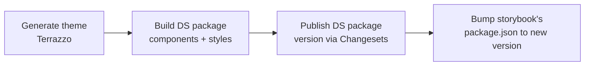

# Cascade DS

A token-driven React design system: design tokens in, themed CSS + typed
components out. Built as a pnpm/Lerna monorepo with four packages that form
one pipeline:

```
tokens  →  generator  →  styles  →  components  →  storybook
(source)   (Terrazzo)    (output)   (React + CSS)   (docs/preview)
```

- **[`packages/tokens`](./packages/tokens)** — [DTCG](https://www.designtokens.org/)-format
  JSON token source of truth (primitive → semantic → component layers),
  composed via a resolver.
- **[`packages/generator`](./packages/generator)** — runs
  [Terrazzo](https://terrazzo.app/) against the token resolver to produce
  CSS custom properties and a typed theme object.
- **[`packages/styles`](./packages/styles)** — the generated output
  (`index.css`, `theme.js`, `theme.d.ts`). Nothing here is hand-written.
- **[`packages/components`](./packages/components)** — React components,
  styled with [Linaria](https://linaria.dev/) +
  [`class-variance-authority`](https://cva.style/), consuming
  `@cascade-ds/styles`.
- **[`packages/storybook`](./packages/storybook)** — Storybook instance for
  developing and reviewing components in isolation.

See the [ADRs](./adr) for the reasoning behind the generator and styling
choices; the [package READMEs](./packages) go deeper on each stage.

## Stack

| Concern            | Choice                                              |
| ------------------ | ---------------------------------------------------- |
| Language           | TypeScript (strict), React 19                        |
| Monorepo tooling   | pnpm workspaces + Lerna (versioning/publishing only)  |
| Token format       | DTCG JSON, composed via a DTCG resolver               |
| Token generator    | Terrazzo (`@terrazzo/cli`, `plugin-css`, `plugin-css-in-js`) — see [ADR-001](./adr/ADR-001-generator.md) |
| Component styling  | Linaria (zero-runtime CSS-in-JS) + `class-variance-authority` for variants — see [ADR-002](./adr/ADR-002-styling-library.md) |
| Component bundling | tsup (`packages/components`), Rollup + `@wyw-in-js` for Linaria extraction |
| Testing            | Vitest + React Testing Library (jsdom), Istanbul coverage |
| Linting/formatting | ESLint (typescript-eslint, jsx-a11y, react-hooks) + Prettier |
| Docs/preview       | Storybook 10 (`@storybook/react-vite`)                |

### Why Terrazzo over Style Dictionary

Style Dictionary made light/dark (and future) theme permutations awkward to
model. Terrazzo's CSS plugin generates per-theme permutations directly, and
its `plugin-css-in-js` output gives typed token references for component
styles. Full reasoning: [ADR-001](./adr/ADR-001-generator.md).

### Why Linaria over Styled-Components / Tailwind

Styled-Components ships a runtime that every consuming app pays for on
every render. Tailwind pushes styling into markup instead of co-located,
token-driven component styles. Linaria compiles to static CSS at build
time — Styled-Components' authoring ergonomics, zero runtime cost to
consumers. Full reasoning: [ADR-002](./adr/ADR-002-styling-library.md).

### Token model: primitive → semantic → component

Tokens are layered so components never hardcode raw values:

```css
/* ❌ primitive, don't consume directly in components */
color: var(--color-blue-500);

/* ✅ semantic, this is the contract components use */
color: var(--color-text-primary);
```

Retheming or rebranding means changing the token source once — components
that only reference semantic tokens update automatically. See
[`packages/tokens`](./packages/tokens/README.md) and
[`packages/styles`](./packages/styles/README.md) for the full model,
including how light/dark theme resolution works.

## Getting started

```sh
pnpm install

# regenerate styles/theme.js from token source
pnpm style-build

# run the component library's tests
pnpm test

# run Storybook
pnpm storybook
```

## Repo layout

```
packages/
├── tokens/       # token source (DTCG JSON + resolver)
├── generator/    # Terrazzo config, turns tokens/ into styles/
├── styles/       # generated CSS + typed theme (build output, not hand-edited)
├── components/   # React component library
└── storybook/    # Storybook app consuming components + styles
adr/              # architecture decision records
```

## CI/CD pipeline

Every merge to `main` that touches tokens, generator config, or components
runs the full pipeline below, in order. Each stage depends on the previous
one's output — the pipeline is designed to only ever publish a components
package that was built against tokens that were actually just generated.

1. **Generate theme with Terrazzo**
   Run `pnpm --filter @cascade-ds/generator run build` (`pnpm style-build`
   at the root) so `packages/styles/{index.css,theme.js,theme.d.ts}` reflect
   the current token source. Fails the pipeline on any Terrazzo lint error
   (invalid color/dimension/typography/etc., per `terrazzo.config.ts`).

2. **Build the DS package (components + styles)**
   Build `@cascade-ds/components` (tsup) against the freshly generated
   `@cascade-ds/styles`, so the published bundle always embeds the token
   output from step 1 rather than a stale local build.

3. **Publish the DS package — version bump via Changesets**
   Use [Changesets](https://github.com/changesets/changesets) to consume
   accumulated changeset files, bump `@cascade-ds/components` (and
   `@cascade-ds/styles` when it changed) to a new semver version, generate
   the changelog, and publish to the registry. The version bump and the
   published artifact come from the same CI run, so the published version
   number always matches what was actually built in step 2.

4. **Bump Storybook's dependency on the new DS version**
   After publish, update `packages/storybook/package.json`'s
   `@cascade-ds/components` (and `@cascade-ds/styles`) entries to the
   version just published, `pnpm install` to refresh the lockfile, and
   commit that change — so Storybook always previews the version of the
   design system that consumers can actually install, not an in-repo
   workspace reference.



Steps 1–2 also run on every pull request (build + test + lint only, no
publish) so token or component changes are validated before merge.
